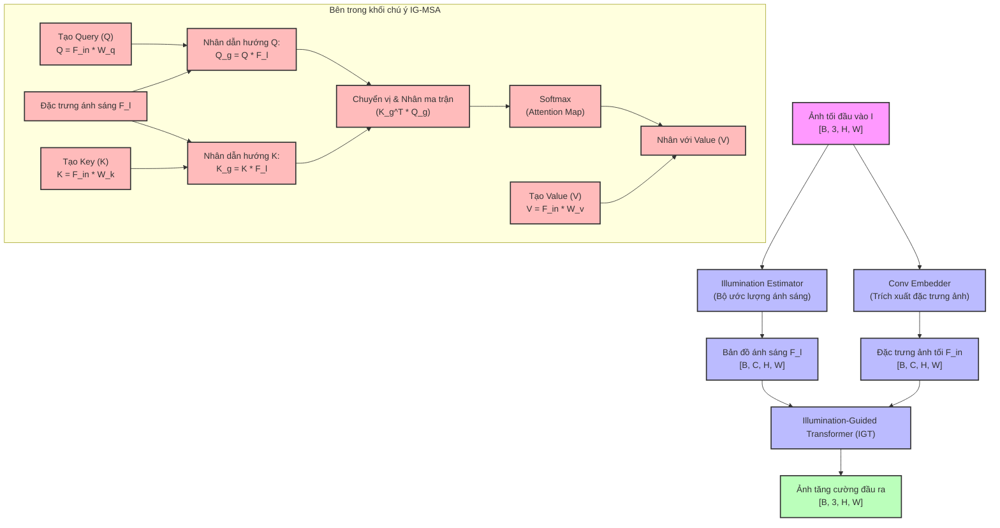

# Phần 3: Giải Mã Kiến Trúc Cốt Lõi & Sơ Đồ Mermaid (Core Architecture)

Tài liệu này sẽ đi sâu phân tích cơ chế hoạt động bên trong của **Retinexformer**, đặc biệt là hai đóng góp công nghệ quan trọng nhất: **One-stage Retinex Propagation** (Khuyếch tán Retinex một giai đoạn) và **Illumination-Guided Attention (IG-MSA)** (Khối chú ý tự thích ứng ánh sáng).

---

## 📐 1. One-stage Retinex Propagation (Retinex Một Giai Đoạn)

### Hạn chế của mô hình Hai giai đoạn cũ (Two-stage)
Các mô hình cũ (như RetinexNet) thường dùng hai mạng độc lập để phân rã ảnh tối thành **Reflectance** (Phản xạ - chứa cấu trúc) và **Illumination** (Ánh sáng). Sau đó, họ khử nhiễu trên ảnh Reflectance và tăng sáng trên bản đồ Illumination rồi nhân lại với nhau.
> **Lỗi lan truyền sai số (Error Propagation):** Nếu mạng phân rã bước 1 bị lỗi (ví dụ: nhận diện nhầm nhiễu cảm biến thành chi tiết cấu trúc), lỗi đó sẽ truyền thẳng sang bước 2 và bị khuếch đại lên gấp nhiều lần ở ảnh đầu ra cuối cùng.

### Bước đột phá của Retinexformer (One-stage)
Retinexformer đề xuất đưa toán học phân rã Retinex **vào thẳng bên trong** quá trình truyền tín hiệu của mạng nơ-ron Transformer. Thay vì chia làm hai mạng độc lập, Retinexformer ước lượng một bản đồ ánh sáng thô lúc đầu, sau đó nạp bản đồ này cùng với đặc trưng ảnh tối vào một chuỗi các khối Transformer liên tục. 
* Mạng sẽ học cách **đồng thời** khôi phục cấu trúc và hiệu chỉnh độ sáng ở mọi lớp đặc trưng.
* Khắc phục hoàn toàn lỗi lan truyền sai số vì mọi thành phần đều được tối ưu hóa đồng bộ (End-to-End).

---

## ⚡ 2. Illumination-Guided Multi-head Self-Attention (IG-MSA)

Móng vuốt thực sự giúp Retinexformer vượt mặt các Transformer thông thường chính là cơ chế chú ý **IG-MSA**.

### Tại sao Self-Attention thông thường thất bại trong bóng tối?
1. **Gánh nặng tính toán**: Khối Self-Attention chuẩn của ViT có độ phức tạp tính toán bình phương $O(N^2)$ theo số lượng pixel, làm tràn VRAM GPU khi xử lý ảnh độ phân giải cao.
2. **Điểm mù nhiễu**: Trong ảnh tối, các pixel nhiễu cảm biến có cường độ thất thường sẽ làm nhiễu loạn ma trận Attention, khiến mạng "chú ý" nhầm vào các hạt nhiễu thay vì cấu trúc vật thể thực sự.

### Cơ chế đột phá của IG-MSA
1. **Tính toán theo chiều kênh (Channel-wise Attention)**: Giống như Restormer, IG-MSA tính toán cơ chế chú ý trên các kênh đặc trưng thay vì không gian pixel. Điều này giúp độ phức tạp giảm xuống mức **tuyến tính** $O(N)$, siêu nhẹ và siêu nhanh.
2. **Dẫn đường bằng ánh sáng (Illumination Guidance)**: 
   * Mạng sử dụng đặc trưng ánh sáng thô $F_l$ để tạo ra một ma trận hướng dẫn.
   * Ma trận này được nhân trực tiếp với ma trận Query ($Q$) và Key ($K$) trước khi tính toán Attention.
   * **Ý nghĩa vật lý**: Nó đóng vai trò như một bộ lọc, ép mô hình phải bỏ qua các pixel nhiễu ở vùng tối sâu và tập trung tài nguyên tính toán để khôi phục cấu trúc ở các vùng biên giao thoa sáng - tối.

---

## 📊 3. Sơ Đồ Luồng Dữ Liệu Của Mô Hình (Mermaid Flowchart)

Dưới đây là sơ đồ Mermaid mô tả dòng chảy của các Tensor đặc trưng đi qua mô hình Retinexformer và cơ chế hoạt động của khối IG-MSA:

