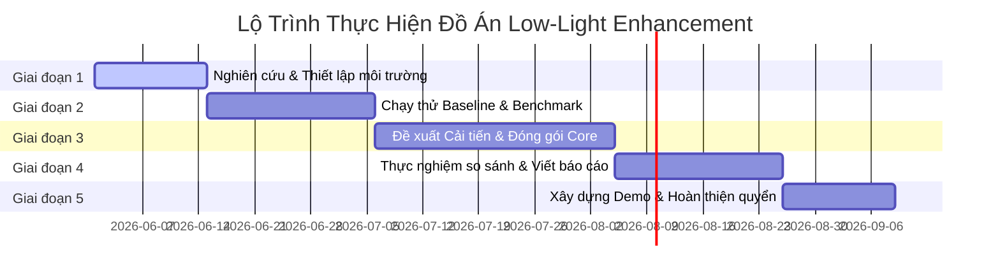

# Đề Xuất Định Hướng & Lộ Trình Nghiên Cứu Đồ Án Tốt Nghiệp (Thesis Proposal)

Chào cả nhóm! Sau khi hoàn thành đợt khảo sát song song cực kỳ chi tiết của 5 nhánh nghiên cứu bài toán **Low-Light Image Enhancement (LLIE)**, tôi xin đưa ra bản đề xuất định hướng chiến lược này. Bản đề xuất được xây dựng dựa trên sự cân bằng hoàn hảo giữa: **Tính mới trong nghiên cứu (để đạt điểm xuất sắc từ hội đồng)** và **Tính thực dụng, khả năng phân chia công việc trong nhóm**.

---

## 🎯 1. Hai Hướng Đi Tối Ưu Nhất Cho Đồ Án Tốt Nghiệp

Dựa trên phân tích khoảng trống nghiên cứu, tôi đề xuất nhóm của bạn nên chọn một trong hai phương án đột phá dưới đây:

### 🌟 PHƯƠNG ÁN 1: Tăng Cường Ảnh Thiếu Sáng Phục Vụ Phát Hiện Vật Thể Đêm (Nhánh Downstream Task)
*Đây là phương án **khuyên dùng nhất** vì nó cực kỳ thực tế, dễ chia việc cho nhóm nhiều thành viên và rất dễ ghi điểm tuyệt đối khi thuyết trình bảo vệ trước hội đồng khoa học nhờ phần demo trực quan.*

* **Ý tưởng cốt lõi**: Thiết kế một module tăng sáng siêu nhẹ (tiền xử lý) đứng trước mô hình Object Detection (ví dụ: YOLOv8 hoặc YOLOv10) để phát hiện xe cộ, người đi bộ trong đêm.
* **Điểm mới nghiên cứu (Gap Khai Thác)**:
  * Tránh dùng các hàm loss truyền thống như MSE. Thay vào đó, nhóm bạn sẽ đề xuất **Semantic-Guided Feature Loss (Hàm loss định hướng ngữ nghĩa)**: trích xuất các đặc trưng trung gian từ mạng YOLOv8 để bắt mô hình tăng sáng phải khôi phục đúng phần cạnh, kết cấu của vật thể thay vì chỉ tăng sáng vô nghĩa.
* **Dataset sử dụng**:
  * *Dataset chính để train/test*: [ExDark](https://github.com/cs-chan/Exclusively-Dark-Image-Dataset) hoặc [LoLI-Street](https://github.com/tanvirnwu/TriFuse) (đều có sẵn bounding box và ảnh cặp đường phố).
* **Phân chia công việc cực tốt cho nhóm (Ví dụ nhóm 3 người)**:
  * *Thành viên 1*: Triển khai, tiền xử lý dataset ExDark và huấn luyện mô hình Object Detection YOLOv8 ban đêm làm baseline.
  * *Thành viên 2*: Thiết lập và cải tiến module tăng sáng siêu nhẹ (ví dụ: cải tiến Zero-DCE hoặc SCI).
  * *Thành viên 3*: Tích hợp hai mô hình, thiết kế hàm Loss chung và xây dựng một ứng dụng Giao diện Web (Web App) trực quan (Cho phép tải video camera giám sát đêm lên và vẽ bounding box phát hiện vật thể thời gian thực trước/sau khi tăng sáng).

---

### 🌟 PHƯƠNG ÁN 2: Bộ Tăng Cường Ánh Sáng Thích Ứng Không Gian & Chống Cháy Sáng (Nhánh RGB Enhancement)
*Phương án này phù hợp nếu nhóm bạn yêu thích bài toán xử lý ảnh thuần túy, muốn đi sâu vào kiến trúc mạng nơ-ron sâu và tối ưu hóa chất lượng thị giác ảnh.*

* **Ý tưởng cốt lõi**: Cải tiến một kiến trúc baseline mạnh (ví dụ: KinD hoặc Retinexformer) để xử lý hoàn hảo điều kiện ánh sáng không đồng đều (non-uniform) và ngược sáng (backlight) ngoài thực tế.
* **Điểm mới nghiên cứu (Gap Khai Thác)**:
  * Tích hợp cơ chế **Spatially-Adaptive Attention (Chú ý tự thích ứng không gian)**: Mô hình tự động phân tách ảnh thành các vùng phơi sáng khác nhau. Vùng tối sẽ được tăng sáng mạnh, trong khi vùng sáng sẵn (như bóng đèn, đèn xe) sẽ được kìm hãm phơi sáng để chống hiện tượng cháy sáng gắt (over-exposure).
* **Dataset sử dụng**:
  * *Dataset chính*: [LOL-v2 Real](https://github.com/flyywh/Awesome-Low-Light-Enhancement) (để benchmark lấy số liệu khoa học so sánh với các paper khác).
  * *Dataset test generalization*: [DICM](https://github.com/Li-Chongyi/Zero-DCE) và các ảnh ngược sáng thực tế.
* **Phân chia công việc (Ví dụ nhóm 3 người)**:
  * *Thành viên 1*: Quản lý dữ liệu, thiết lập pipeline huấn luyện baseline KinD/Retinexformer trên tập LOL-v2.
  * *Thành viên 2*: Thiết kế module Spatially-Adaptive Attention và code tích hợp vào mạng baseline.
  * *Thành viên 3*: Thực hiện các thí nghiệm so sánh định lượng (PSNR/SSIM/LPIPS), chạy cross-dataset để chứng minh độ bền bỉ của mô hình và viết báo cáo khoa học.

---

## 📈 2. Lộ Trình Hành Động Chi Tiết (Roadmap) Cho Đồ Án

Dù chọn phương án nào, dưới đây là lộ trình hành động khoa học 5 bước để đảm bảo tiến độ đồ án của nhóm:

### 📍 Giai đoạn 1: Thiết lập & Đọc Paper Chìa Khóa (Tuần 1 - Tuần 2)
* Cả nhóm đọc thật kỹ 2 bài báo tương ứng với phương án đã chọn (ví dụ: Zero-DCE và TriFuse cho Phương án 1).
* Thiết lập môi trường ảo PyTorch chung cho cả nhóm để đảm bảo không bị xung đột phiên bản.

### 📍 Giai đoạn 2: Thu thập Dữ liệu & Run Baseline (Tuần 3 - Tuần 5)
* Tải các bộ dữ liệu tương ứng từ các link chính chủ đã khảo sát về máy.
* Clone mã nguồn chính thức của mô hình baseline, chạy thử thành công khâu Train và Eval trên máy của nhóm để ra được số liệu gốc.

### 📍 Giai đoạn 3: Hiện thực hóa Ý Tưởng Cải Tiến (Tuần 6 - Tuần 9)
* Đây là giai đoạn cốt lõi: Viết mã nguồn tích hợp điểm cải tiến (Attention mới hoặc Loss mới).
* Huấn luyện mô hình cải tiến và tinh chỉnh các siêu tham số (hyperparameters).

### 📍 Giai đoạn 4: Viết Báo Cáo & So Sánh Khoa Học (Tuần 10 - Tuần 12)
* Lập bảng so sánh định lượng điểm số giữa mô hình cải tiến của nhóm và các mô hình đi trước.
* Vẽ biểu đồ Loss, vẽ ảnh so sánh chất lượng trực quan trước/sau cải tiến để đưa vào Chương 3 và Chương 4 của quyển đồ án.

### 📍 Giai đoạn 5: Đóng gói Sản phẩm & Làm Demo Web (Tuần 13 - Tuần 14)
* Xây dựng một giao diện Web đơn giản (dùng Gradio hoặc Streamlit - cực kỳ dễ code bằng Python). Giao diện cho phép người dùng kéo thả ảnh hoặc video tối vào, nhấn nút và trả về ảnh/video đã được tăng sáng và phát hiện vật thể song song.
* Đây sẽ là vũ khí tối thượng giúp nhóm bạn chinh phục tuyệt đối hội đồng chấm thi đồ án tốt nghiệp!
